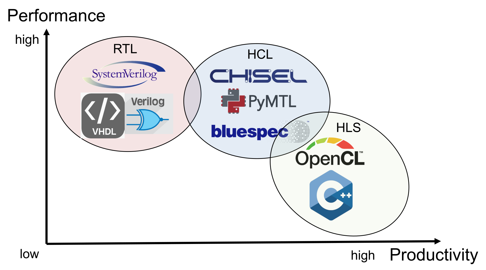

# RISC-V Resources

This repository will hold all the resources that we may utilize, including toolchains, reference designs, documents and etc. 

## Toolchains

### [RISC-V GNU Compiler Toolchain](https://github.com/riscv-collab/riscv-gnu-toolchain#)

This is the official RISC-V toolchain, which provide cross compliation and instruction-level simulation.
We can use this to **generate test cases and verify our design**. 

### [Verilator](https://www.veripool.org/verilator/)

Verilator is a powerful, open-source Verilog/SystemVerilog simulator. 
**We can use it instead of Vivado** before we need to connect to the demo board.

### [Chisel](https://www.chisel-lang.org/)

Chisel is a Hardware Construction Language (HCL) embedded in [Scala](https://www.scala-lang.org/).
It provides higher level abstraction of hardware, **generating Verilog code after compliation**.

## Reference Designs

### [ultraembedded riscv](https://github.com/ultraembedded/riscv)

A 32-bit RISC-V core written in Verilog and an instruction set simulator supporting RV32IM.

### [ultraembedded biriscv](https://github.com/ultraembedded/biriscv)

A 32-bit Superscalar RISC-V CPU.

### [riscv-sodor](https://github.com/ucb-bar/riscv-sodor)

riscv-sodor is **a set of educational microarchitectures for RISC-V ISA** written in Chisel, developed by UC Berkeley.
It provides examples of 1-stage, 2-stage, 3-stage and 5-stage cores, which I think very worth learning.

### [PicoRV32](https://github.com/YosysHQ/picorv32)

PicoRV32 is a CPU core that implements the RISC-V RV32IMC Instruction Set developed by [Yosys Open SYnthesis Suite group](https://github.com/YosysHQ).
They have developed many open source EDA tools.
[Here](https://juejin.cn/post/7372245998897774629) is a brief introduction of the project.

## Documents

### [Competition Document](http://univ.ciciec.com/nd.jsp?id=879#_jcp=1)

### RV32I ISA

There are totally 40 intructions in RV32I.
The official document of RV32I is in charpter 2 of [here](https://drive.google.com/file/d/1uviu1nH-tScFfgrovvFCrj7Omv8tFtkp/view?pli=1).
We can also see the sepcification of the instructions in [this document](https://msyksphinz-self.github.io/riscv-isadoc/html/rvi.html#).

